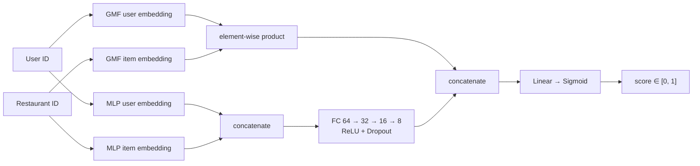

<div align="center">

# Neural Restaurant Recommender with Explainable AI

**Neural Collaborative Filtering (GMF · MLP · NeuMF) with KernelSHAP explanations**

[](https://colab.research.google.com/github/USERNAME/REPO/blob/main/neural_restaurant_recommender_shap.ipynb)


-6f42c1)


*Author: Aygul Aliyeva*

</div>

---

## Table of Contents

1. [Overview](#overview)
2. [Key Results](#key-results)
3. [Problem Formulation](#problem-formulation)
4. [Dataset](#dataset)
5. [Models](#models)
6. [Evaluation Protocol](#evaluation-protocol)
7. [Experimental Results](#experimental-results)
8. [Representation Learning](#representation-learning)
9. [Explainability with SHAP](#explainability-with-shap)
10. [Limitations](#limitations)
11. [Future Work](#future-work)
12. [Reproducibility](#reproducibility)
13. [AI Usage Declaration](#ai-usage-declaration)
14. [References](#references)

---

## Overview

People tend to return to the same few restaurants, not because those are the best options, but because they are familiar. This project builds a recommender system that learns from users' visit histories and predicts which **unvisited** restaurants a user is most likely to enjoy.

The project implements the Neural Collaborative Filtering framework of He et al. (2017) in PyTorch and goes one step further by opening the black box: **KernelSHAP** is applied to the learned embedding space to study which latent dimensions drive individual predictions.

**Contributions of this notebook**

- End-to-end implicit-feedback pipeline: preprocessing, leave-one-out split, negative sampling
- Three models trained and compared under identical conditions: **GMF** (baseline), **MLP**, **NeuMF**
- Ranking evaluation with **HR@10** and **NDCG@10**
- Embedding analysis with PCA and t-SNE
- Post-hoc explainability with **KernelSHAP at the embedding-dimension level** (64 features per prediction)
- A critical discussion of results, including a random-ranking reference and the limitations of the setup

## Key Results

| Model | HR@10 | NDCG@10 |
|---|:---:|:---:|
| Random ranking (analytical reference) | 0.196 | 0.089 |
| GMF (baseline) | 0.214 | 0.103 |
| MLP | **0.330** | **0.183** |
| NeuMF | 0.324 | 0.176 |

- Non-linear models (MLP, NeuMF) improve HR@10 by roughly **10 percentage points** over the linear GMF baseline.
- NeuMF and MLP perform essentially on par. The gap (0.006 HR@10) is smaller than the sampling noise of a 500-user test set (about ±0.02), so this experiment does not show that either one is better.
- GMF stays close to the random-ranking reference, which means that a purely multiplicative interaction is not enough on this sparse data within 5 epochs.

> The random-ranking reference is computed analytically: with 1 positive among 51 candidates, `HR@10 = 10/51 ≈ 0.196`, and the expected NDCG@10 is `(1/51)·Σ 1/log2(i+2) ≈ 0.089`.

## Problem Formulation

The data is an implicit-feedback interaction matrix **R**:

```
R(u, i) = 1   if user u visited restaurant i
R(u, i) = 0   otherwise (unknown, not necessarily "disliked")
```

The goal is to learn a scoring function `f(u, i) → [0, 1]` that ranks restaurants a user has not yet visited. Training uses binary cross-entropy with sampled negatives.

## Dataset

| Property | Value |
|---|---|
| Source | Yelp2018 user–business interactions (as distributed with the LightGCN benchmark), treated as restaurants |
| Full downloaded set | 1,561,406 interactions · 31,668 users · 38,048 items |
| Subset used | **top 500 most active users** (memory constraint) |
| Interactions | **179,685** |
| Restaurants | **33,249** |
| Sparsity | **98.92%** |
| Feedback type | Implicit (all interactions binarised to 1) |

**Preprocessing**

1. Binarise interactions (any observed visit → label 1)
2. Re-index users and restaurants to consecutive integers (embedding indices)
3. Leave-one-out split: the latest interaction per user is the test item
4. Training: 2 random negatives per positive. Testing: 50 random negatives per user

**Data loading fallback.** The notebook first looks for a local CSV, then downloads the public mirror, and finally generates a synthetic sample if both fail, so every cell can run in any environment.

**Important note on the data.** Star ratings and timestamps in the downloaded data are *generated* by the notebook (random ratings, sequential timestamps), because the benchmark files contain only user–item pairs. The ratings are never used by the models, but the "latest interaction" used for the leave-one-out split therefore reflects file order rather than real time.

## Models



| Model | Idea |
|---|---|
| **GMF** (baseline) | `ŷ = σ(hᵀ(p_u ⊙ q_i))`. A generalised matrix factorisation: element-wise product of embeddings, no mixing across dimensions |
| **MLP** | Concatenated embeddings → fully connected layers `[64, 32, 16, 8]` with ReLU and dropout. Can model non-linear user–item interactions |
| **NeuMF** | `ŷ = σ(hᵀ[φ_GMF ⊕ φ_MLP])`. Fuses both paths with **separate embeddings**, so each path learns the representation it needs |

## Evaluation Protocol

Following He et al. (2017):

- **Leave-one-out:** one held-out item per user
- **Candidate set:** the held-out item ranked against 50 random negatives (51 candidates)
- **HR@10:** fraction of users whose held-out item appears in the top 10
- **NDCG@10:** like HR@10, but rewards higher positions in the list

| Hyperparameter | Value |
|---|---|
| Optimiser | Adam, lr = 0.001 |
| Loss | Binary cross-entropy |
| Epochs | 5 |
| Batch size | 512 |
| Embedding size | 32 |
| MLP layers | [64, 32, 16, 8] |
| Dropout | 0.2 |
| Negatives per positive (train) | 2 |
| Negatives per user (test) | 50 |

## Experimental Results

| Model | Best HR@10 | Best NDCG@10 | Final-epoch loss |
|---|:---:|:---:|:---:|
| GMF | 0.214 | 0.103 | 0.6293 |
| MLP | 0.330 | 0.183 | 0.5628 |
| NeuMF | 0.324 | 0.176 | 0.5486 |

**Discussion**

- **GMF** barely moves in loss or ranking quality, which is consistent with its limited expressiveness on very sparse data.
- **MLP** improves steadily on every epoch, showing the value of non-linear interactions.
- **NeuMF** reaches the lowest training loss but not a better ranking metric than MLP. Likely causes: more parameters that need more epochs, and no pre-training of the GMF and MLP components, which He et al. identify as the main training strategy for NeuMF.

## Representation Learning

The embedding layers are the representation-learning component: instead of hand-crafted taste features, the model learns a 32-dimensional vector per user and per restaurant. The GMF embeddings of the trained NeuMF were projected to 2D with PCA and t-SNE.

- PCA explains only **8.9%** (users) and **6.6%** (restaurants) of the variance in two components, so the information is spread across many dimensions.
- No clear clusters appear among restaurants. With 33k restaurants and 500 users, most restaurants have only one or two interactions and their embeddings are poorly differentiated.

## Explainability with SHAP

**Why embedding level?** NeuMF takes integer IDs as input, so explaining ID features would be uninformative. Instead, for each user–restaurant pair the 32-dim user and 32-dim restaurant GMF embeddings are concatenated into a **64-dimensional feature vector**, and the model is explained as a function of these dimensions.

- Method: **KernelSHAP** (Captum), 300 samples per explanation
- Baseline: zero vector (no latent signal)
- Explained samples: 10 positive test pairs

**Findings**

- A small number of dimensions accounts for most of the total absolute SHAP mass.
- The balance between user-side and restaurant-side contributions differs from sample to sample: some predictions are driven mainly by the user's taste profile, others by the restaurant's own signal.
- The dimensions are abstract latent factors. Without extra probing (for example correlating them with cuisine or price level) they cannot be translated into human-readable reasons.

## Limitations

- **Cold start.** Unseen users and restaurants have no embeddings.
- **Implicit-feedback assumption.** Unvisited restaurants are treated as negatives, although the user may simply not know them.
- **Small evaluation set.** 500 test users give a standard error of about 0.02 on HR@10, so small differences between models are not significant. Results come from a single run with one seed.
- **Optimistic reporting.** The best epoch is selected using the test metrics, since no separate validation set is used.
- **Artificial ratings and timestamps** (see the dataset note above).
- **SHAP wrapper simplification.** The wrapper feeds GMF embeddings into both the GMF and MLP paths, while the real NeuMF uses separate MLP embeddings. The explanations therefore cover the GMF embedding space only.
- **Short training.** 5 epochs, no hyperparameter search, no pre-training.

## Future Work

- Pre-train GMF and MLP separately and initialise NeuMF with them, as in the original paper
- Train longer with early stopping on a validation split, and average over several seeds
- Use real timestamps and the full Yelp Open Dataset with restaurant categories
- Add content features (cuisine, price, location) to address cold start and make SHAP explanations human-readable
- Compare against stronger baselines (ItemKNN, BPR-MF, LightGCN)

## Reproducibility

**Run in Google Colab**

1. Click the **Open in Colab** badge at the top
2. `Runtime → Run all`
3. The data is downloaded automatically. If the download fails, a synthetic fallback is generated
4. A GPU is optional (the reported results were produced on CPU)

**Run locally**

```bash
git clone https://github.com/USERNAME/REPO.git
cd REPO
pip install torch captum scikit-learn pandas numpy matplotlib seaborn
jupyter notebook neural_restaurant_recommender_shap.ipynb
```

**Environment used for the reported results:** PyTorch 2.10.0 (CPU), Captum 0.9.0, scikit-learn 1.6.1, pandas 2.2.2, NumPy 2.0.2.

**Random seeds:** `numpy = 7`, `torch = 0`, `random = 42` (seeds are re-fixed after `NCF_Data` construction so negative sampling is reproducible).

## AI Usage Declaration

| Item | Response |
|---|---|
| Generative AI used? | Yes |
| Tool | Claude (Anthropic) |
| Purpose | Debugging PyTorch code, fixing tensor shape errors, checking syntax, reviewing notebook structure |
| Verified by the author | All model results, training outputs and SHAP interpretations |

The project structure, model choices, training logic and analysis are the author's own, based on He et al. (2017). Every cell was run and every output checked manually.

## References

1. He, X., Liao, L., Zhang, H., Nie, L., Hu, X., & Chua, T.-S. (2017). **Neural Collaborative Filtering.** *Proceedings of the 26th International Conference on World Wide Web (WWW)*.
2. Lundberg, S. M., & Lee, S.-I. (2017). **A Unified Approach to Interpreting Model Predictions.** *Advances in Neural Information Processing Systems (NeurIPS)*.
3. Kokhlikyan, N., et al. (2020). **Captum: A unified and generic model interpretability library for PyTorch.** *arXiv:2009.07896*.
4. He, X., et al. (2020). **LightGCN: Simplifying and Powering Graph Convolution Network for Recommendation.** *SIGIR*. (source of the Yelp2018 benchmark split)
5. Yelp Open Dataset. https://www.yelp.com/dataset
